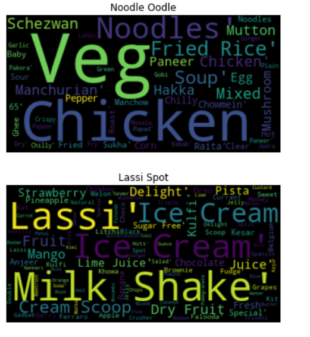

# Zomato price trend and sentiment analysis

## Problem:-

- The basic idea of analyzing the Zomato dataset is to get a fair idea about the factors affecting the establishment of different types of the restaurant at different places in Bengaluru, aggregate rating of each restaurant, Bengaluru being one such city has more than 12,000 restaurants with restaurants serving dishes from all over the world. 
- With each day new restaurants opening the industry hasn't been saturated yet and the demand is increasing day by day. Inspite of increasing demand it, however, has become difficult for new restaurants to compete with established restaurants. 
- Most of them serving the same food. Bengaluru being an IT capital of India. Most of the people here are dependent mainly on the restaurant food as they don’t have time to cook for themselves.

Estimate
1.  type of restrants,dishes,cuisines,cost for dinning preffered
2.  Location famous for online orders and book_table(what rest_type)
3.  Restrants famous for paricular dishes(dish_liked)
4.  Places with common menus and unique dishes.
5.  Use the voting,rate to estimate the best restrant in bangalores
6. Sentimental analysis (review list)

### Exploratory Data Analysis
                                          
                                          Restaurant Name:-
- We have a Feature/Column called Name that says about all the Restaurants that tie/partnered with zomato in Bangalore. We have several Restaurants few named like Cafe Coffee Day, Onesta, Just Bake, Kranti sweets and more.

 

- Bar plot for top 20 restaurants with their count from the above graph, we can see that we almost have 100 restaurants for the Franchise of Cafe Coffee Day.

 

- Bangalore a IT hub everone needs a quick bites (reallly sad)

                                        Cost Of Two
  
  - Most of them are spending on zomato food within the price range of 200-1000.
  
   

                                       Briyani Analysis
                                      
    

 
 Inference:

- There is around 35 briyani centers and top 5 unique briyani shops spreaded across
- Ambur star briyani is one with the more count compared to other briyani centers
- While karnatka briyani point is unique to a particular location

- BTM has a highest briyani foods(Briyani lovers it the place to chill)
- Price range of briyani varies from 200-500
- Most of them with online orders

                                           Online orders

Of all the registered Restaurants in zomato, How many are Accepting online orders and how many are not accepting. from the graph below you can understand that we have almost 30,000 Restaurants in Bangalore that Accepts online orders through zomato and Almost of 20,000 are not accpeting any online orders through zomato.

   

                                          Cuisines
                                          
  With the help of the varities provided by the restrants we are going to analyse it with the word cloud to get a clear picutre of the restraunts.
  
   

### Sentimental Analysis:

- Using nltk package - stop words, regex cleaned the reviews
- Using sentiment analysis package - analysed the reviews and the compound score
- Filled the rating with the help of compound scores

### Feature Engineering:

Filling_Null_Values:

- Dish_liked(dropped) -->as it contains more than 60% of null values.
- Cuisines            --> With the help of the word cloud from the menu filled with the most famous cuisines
- Rating              --> Filled using the reviews (Snetiment Analysis)
                          Assumption NEW starts lets be good as they are trying new
                          Compound_Score with score greater than 0.2 will be given positive with a rating as 4
                          Lesser than 0.2 is given negative with a rating as 3

### Selection :

Wrapper method:

Backward Elimination: We start with all the features and removes the least significant feature at each iteration which improves the performance of the model.

Selected Features :['address', 'online_order', 'book_table', 'rate', 'votes', 'location', 'rest_type', 'cuisines', 'reviews', 'menu', 'type', 'city']

Dropped on Purpose: URL,Phone_number(Cannot be used for analysis as it is all unique),dish_liked(more than 50%null values)

### Processing:

- Getting dummies is not going to work here as we have columns with address,name,menu
- Using factorize with reference to one of the kaggle kernels(its been verified with its better performance than dummies creation)

### Modeling:

Models- LinearRegression,RandomForestRegressor,GradientBoostingRegressor,AdaBoostRegressor
Performance_metrics- r2_score,accuracy_score

   

#### Overall RandomForest and XGboost are performing best in the prediction

